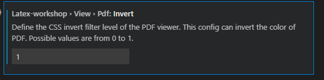

# Use LATEX in Visual Studio Code
**Author:** Diego Iván Perea Montealegre

## First Step

1. 
   - Install [MiKTeX](https://miktex.org/download) and [Strawberry Perl](https://strawberryperl.com/)
   - Open Visual Studio Code and install the extensions `LaTeX Workshop` from James Yu and `LaTeX Snippets` from HaoyunQin

*Figure 1: LaTeX Workshop*

*Figure 2: LaTeX Snippets*

## Second Step

1. Create a new folder
2. In Settings, search for "out dir" and set "Latex workshop - Latex:Out Dir" to `%DIR%/build`

*Figure 3: LaTeX build folder*

3. Create a new file with a `.tex` extension
4. Use the command to compile your file with:  `pdflatex namefile.tex`

*Figure 4: View PDF click magnifying glass*

## Change Dark Mode Page

1. In Settings, search for "pdf invert" and set "Latex workshop - View-Pdf invert" from 0 (normal white) to 1 (dark mode)

*Figure 5: Dark Mode*

PDF in latex in build/hola.pdf

## Modules

- Create a new folder outside of `build` and create a new `.tex` file
- To include the module, use `\input{build/FolderCreatedTo/chapter.tex}`

